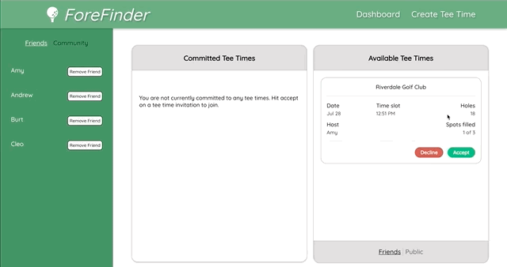

# ForeFinder
<!--  -->

## Table of Contents

* [Overview](#overview)
* [Installation](#installation)
* [Walkthrough](#walkthrough)
* [New Learning](#newlearning)
* [Author](#author)
* [Technologies](#technologies)

Check out our ✨[Heroku Deployment](https://forefinder.herokuapp.com/dashboard)✨

## Overview
ForeFinder is a mobile-focused web application that makes linking up with others for a round of golf easier. Coordination can sometimes be a difficult task when filling spots for a tee time, but ForeFinder provides the tools to make that task a hole in one. Add friends to your ForeFinder network to create a private tee time invitation, or send out an invite to the entire ForeFinder community to get your slots filled ASAP!

 - Developed in tandem with a team from the back-end program at [Turing School of Software & Design](https://turing.edu/) (view their repo [here](https://forefinder.herokuapp.com/dashboard))
 - Built using [React](https://reactjs.org/) + [React Router](reactrouter.com)
 - End-to-end tested with [Cypress](cypress.io)
 - CI/CD with [CircleCI](circleci.com) + [Heroku](heroku.com)
 - Responsive design for mobile, tablet or desktop
 - [PWA](https://developer.mozilla.org/en-US/docs/Web/Progressive_web_apps) optimization for mobile installation + caching

## Installation

### Business:
1. `git clone` this [repo](https://github.com/foreFinder/fore-finder-fe)
2. `cd` into project directory
3. Run `npm i` to install the project dependencies
4. Run `npm start` to begin the development server & open the app in a separate window

### Pleasure:
1. Visit the [deployed app](https://forefinder.herokuapp.com/dashboard) in a Chrome browser
2. Open the Chrome controls (three dots in the top right) and select "Add to Homepage" (mobile) or "Install ForeFinder" (desktop)
3. The ForeFinder app should now be accessible as an app on your phone's home screen or in your computer's "Chrome Apps" folder

## Walkthrough

Once ForeFinder loads, the dashboard will be displayed showing a couple widgets, committed tee times and available tee times.  The committed tee times widget displays times that the user has either created or has accepted an invitation to.  Whereas the available tee times can toggle tee time invitations from people in their network of friends, or invitations that are open to the entire ForeFinder community.  

Each of the available tee times show how many positions are still available, the host of the tee time, the actual tee time and the course.  If a user has any available tee times displayed, they will have the option to select Accept, which will add the time to their committed tee times list, or decline, which will delete the tee time from the available list.  Once all the open positions are filled, the tee time will be removed from the available list for all users.

If the current user would like to create a new tee time, they can click the 'Create Tee Time' link in the header.  This will redirect the user to a form to select the course to be played, the date, the tee time, the number of open positions, number of holes and the option to make the event public to the ForeFinder community or private, where they can invite all their friends or specific friends.  Once the form is complete it will notify the user the event has been created and add that event to their committed tee times list. 

The user will also be able to see their friends list and all members of the ForeFinder community from the dashboard (on large screens) or from a link in the header (smaller screens).  Once on the community page, the user will be able to add and delete friends from their community.  

## Demo GIFs

### Accept a Tee Time Invitation

<!--  -->

### Tee Time Event Creation Form

<!--  -->

                   
### Mobile navigation

<!--  -->

Lighthouse Report 

## Learning Goals
- Communicating as a full-stack team to ensure data flowed efficently and effectively from front to back
- Learning, developing, and practicing a Git Rebase workflow
- Configuring and utilizing CircleCI to ensure early and consistent deployment to production
- Interfacing with PWA technologies to allow mobile installation and caching

## Project Progression

Because this project was our first full-stack effort, planning was an important first step. We used a single GitHub [project board](https://github.com/orgs/foreFinder/projects/1) to add and maintain tasks for both the FE and BE so that we could easily determine what each team was currently working on. Along with building out all applicable user stories, the front-end also utilized a [Miro board](https://miro.com/app/board/o9J_l7sQVZc=/) to wireframe the initial design of the UI and model its components.

Once the planning was complete, the the front-end was able to use the [JSON contract](https://miro.com/app/board/o9J_l7sQVZc=/) modeled by the back-end to build out initial functionality using mock data assuming that the data structure would not change. Once the endpoints were completed and the data we needed skulpted, we were able to link up the back and front-end fairly painlessly.

We continually were referring back to our project board and communicating with one another about progress which was very helpful as we needed to slim down our MVP due to time constraints.  One feature we hoped to have that was later cut out was a login page with authentication of the user.  As we continue to iterate on this project, that will be one feature that we hope to add.  

The last part of the project was to learn a new tech or framework to incorporate into the application.  The front-end team decided to make ForeFinder a progressive web app because we recognized that most users would be using the app from a mobile device.  Seeing as none of the FE team members had experience setting up a PWA, we ran into some struggles with the documentation surrounding service workers and what needed to be included in the manifest.  Luckily, through our continued learned we discovered the framework Workbox which helped clear up the confusion we were facing with writing our own service worker and manifest files. 

## Reflections

All in all, the front-end team was very satisfied with how the project turned out.  We all worked well together as a team, communicated effectively and learned a new feature with how to make an application a functioning PWA.  Seeing as this was the first time that we worked with a back-end team to build a full-stack application, it was very beneficial to learn how to communicate with a back-end team about the FE needs and how we were going to be using/manipulating the data that was being returned from the BE team. Lastly, while it was a bit of a steep learning curve, we all found value with using an interactive git rebase workflow for this project.  

## Authors
<table>
    <tr>
        <td><a href="https://github.com/errabun">Eric Rabun</td>
        <td> <a href="https://github.com/tysnj">Tyson McNutt</td>
        <td><a href="https://github.com/jon-schlandt">Jon Schlandt</td>
        <td><a href="https://github.com/mistercanderson">Chris Anderson</td>
    </tr>
    </tr>
        <td></td>
        <td></td>
        <td></td>
        <td></td>
    </tr>
</table>

## Technologies
<table>
    <tr>
        <td>Framework</td>
        <td>Functionality</td>
        <td>Structure</td>
        <td>Styling</td>
        <td>PWA</td>
    </tr>
    </tr>
        <td></td>
        <td></td>
        <td></td>
        <td></td>
        <td></td>
    </tr>
</table>

